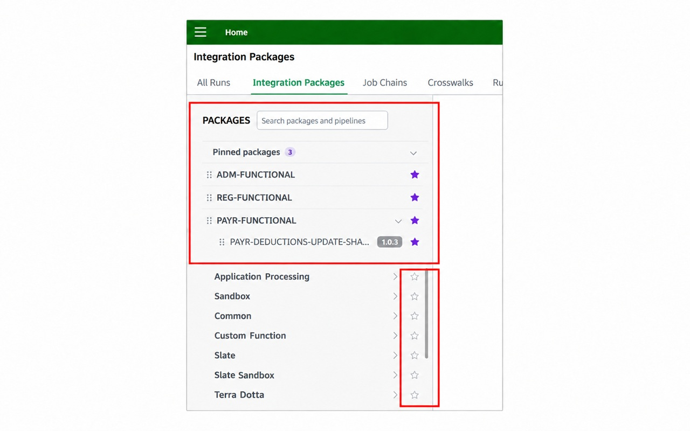
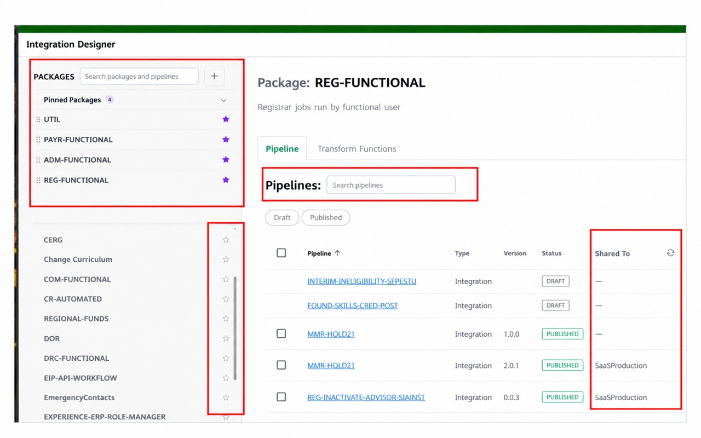
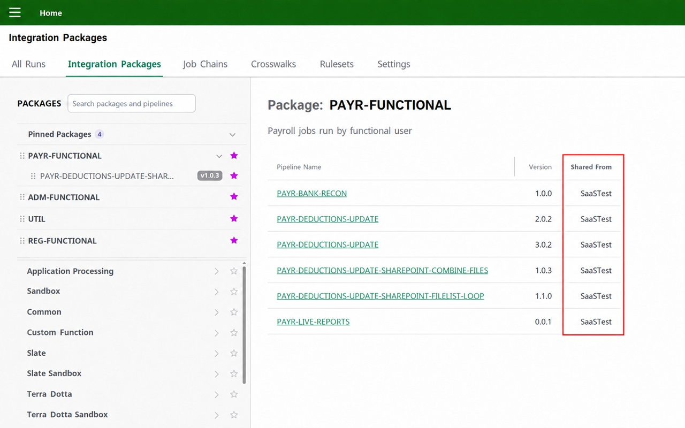

# Integration Navigator

Make Ellucian Integration Packages and Integration Designer easier to navigate in Chrome and Microsoft Edge.

## What It Does

- Scroll and resize the package sidebar independently of the main page.
- Search package and pipeline names, even with different spacing or separators.
- Pin packages and published pipelines, then drag favorites into your preferred order.
- Automatically fit pipeline-name columns, with manual resizing when needed.
- Optionally show **Shared To** in Designer, highlighting version mismatches in red.
- Optionally show **Shared From** in Integration Packages using locally saved Designer sources.
- Customize your toolbar icon, favorite-star colors, and search display.

Favorites stay separate for each page and environment. Standard Experience Test and Production sites are supported, along with university vanity URLs you add in settings.

## Install

[Install from the Chrome Web Store](https://chromewebstore.google.com/detail/integration-navigator/dbmjmmgocklhjnadhmibaldicbgoignd). The same listing works in Chrome and Edge; Edge may ask you to allow extensions from other stores.

You need an institution-provided Ellucian account with access to the supported pages. The extension does not provide access or change packages or pipelines.

Open the extension's toolbar icon to adjust its settings. Store-installed copies receive updates through the browser; [manual installation and update instructions](docs/User-Guide.md#manual-installation) are in the user guide.

## Screenshots

**Pinned Packages:** keep favorite packages and pipelines within reach.

**Integration Designer:** search pipelines in the selected package and see shared destinations.

**Shared From:** see locally remembered Designer sources in Integration Packages.

**Settings:** choose page behavior, search display, icon and favorite colors, and custom sites.

Package and pipeline names in these screenshots are anonymized.

## Help and Documentation

- [User Guide](docs/User-Guide.md): settings, favorites, sharing columns, and installation.
- [Troubleshooting](docs/Troubleshooting.md): updates, page loading, and missing sharing information.
- [Changelog](docs/CHANGELOG.md): version history.
- [Privacy Policy](PRIVACY.md): website access and locally saved data.

Both sharing features are off by default. Shared From requires your consent and visits to Designer in each source environment; its saved information can become stale.

Support: [moore.life@gmail.com](mailto:moore.life@gmail.com).

This extension is not affiliated with or supported by Ellucian.
