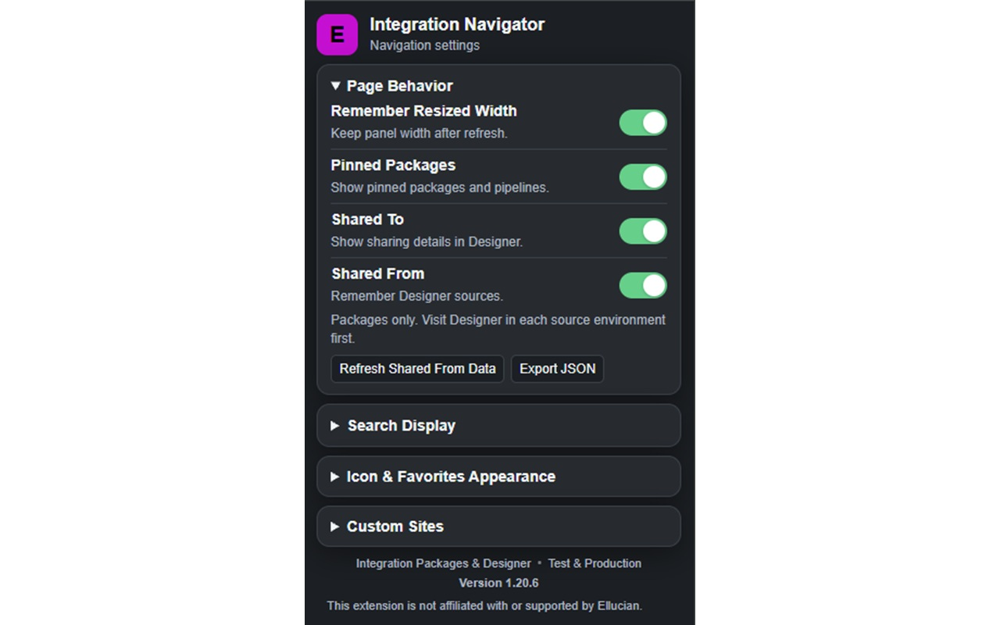

# User Guide

[Back to the README](../README.md) · [Troubleshooting](Troubleshooting.md)

## Getting Started

Install [Integration Navigator from the Chrome Web Store](https://chromewebstore.google.com/detail/integration-navigator/dbmjmmgocklhjnadhmibaldicbgoignd) in Chrome or Edge. In Edge, allow extensions from other stores if prompted, then approve the installation. [Microsoft's installation instructions](https://support.microsoft.com/en-us/edge/add-turn-off-or-remove-extensions-in-microsoft-edge) explain this option.

Open Ellucian Experience and go to **Integration Packages** or **Integration Designer**. Select the extension's toolbar icon to open settings. Its installed version appears at the bottom.

## Navigation and Favorites

The package sidebar scrolls independently, keeping its heading visible. Drag its edge to resize it. Enable **Remember Resized Width** to keep the width after refreshing; widths are remembered separately for each supported page and environment.

Use a package's star to pin it. In Integration Packages, you can also pin published pipelines beneath their package. Designer does not offer pipeline stars because its sidebar only lists packages.

- Select a favorite package to open it, or a favorite pipeline to open that pipeline's page.
- Use the arrow to expand or collapse a favorite's pipelines without opening the package.
- Drag handles to reorder packages or pipelines within their package.
- Use a selected star again to unpin an item, including from the favorites area.
- Resize the favorites area vertically, or collapse it when you need more space.

Favorites and their layout stay separate for Packages and Designer, Test and Production, and different site domains. Hiding favorites does not delete them. Unavailable favorites are hidden without deleting their saved pins.

Pipeline favorites follow the newest available release within their pinned **major version**. For example, `1.0.3` follows newer `1.x.x` releases, not `2.x.x`.

## Search and Pipeline Names

The sidebar search finds package and pipeline names. Designer also has a pipeline search inside the selected package, including entries on other table pages.

Designer pipeline search shows the first 20 matches and a count when there are more. Select **Show More** to add the next 20. It searches all loaded entries without additional Ellucian requests.

Search ignores case, spaces, and separators: `MMR`, `unco mmr`, and `uncommr` can all find `UNCO-MMR`.

Enable **Page Behavior → Show APIs & Sub-Pipelines** to add a **Type** column and the newest published API/Sub-Pipeline release for each name in Integration Packages. These are plain, non-clickable records without run actions; they are not added to the sidebar or favorites. Normal Integration links work as before. These records use the page's normal package response, not extra network lookups or the Designer cache. **Shared From** remains an independent optional column.

Refresh Integration Packages once after installing this update or re-enabling **Show APIs & Sub-Pipelines**. The page then loads the metadata normally, before its sidebar filters out non-runnable entries. Turning this display setting off removes Type and the extra records and clears their temporary in-memory data, without clearing Designer sources or favorites. Turning Shared From off removes only its source column and cache. Source labels require visiting Designer; API/Sub-Pipeline names do not.

**Pipeline Name** automatically fits each selected package within the space remaining after the other visible columns. Names stay on one line. Drag the divider to adjust it or double-click to fit full loaded names, using local horizontal scrolling if needed. Switching packages calculates a fresh width. With the divider focused, arrow keys resize, Enter fits names, and Home restores automatic sizing.

Clipped favorite names have the browser's native full-name tooltip; fully visible names do not. API/Sub-Pipeline names use the browser's built-in tooltip to show “For Reference Only; Cannot Be Run From This Page.” even when fully visible. This guidance applies only to the name, not the entire row; its delay and presentation are controlled by the browser. Action and sharing help appears after a two-second hover or immediately on keyboard focus. Escape dismisses that custom help.

## Settings

### Page Behavior

The section has three groups separated by thin dividers: width memory, pinned favorites, and **Show APIs & Sub-Pipelines**; **Shared To** and **Shared From**; then the two search dropdowns. Both sharing features are off by default. Search titles use the same size and weight as the other setting titles.

### Shared To — Designer

Enable **Shared To** to show destination environments beside published pipelines. Hover or focus a destination to see its newest shared version. Red means that version differs from the published row within the same major version.

Information refreshes when you return from either share flow, even after cancelling. Use the refresh icon beside **Shared To** to recheck the current package view. Hover over the icon for the result, including when no shares are found or a check fails. Completed results are otherwise cached to limit repeated requests; sharing lookups use at most six simultaneous service requests.

Pipelines update individually as their checks finish. Queue waiting does not count toward a service call's 30-second deadline. A timed-out call retains its slot until it actually ends; retries cannot increase traffic beyond six calls. If earlier calls remain stalled, wait or refresh the page before retrying.

### Shared From — Integration Packages

This feature identifies sources from the Designer environments you have visited, rather than reading live share history from Integration Packages.

1. Enable **Shared From** under **Page Behavior** and accept the local-data notice.
2. Visit Designer in each source environment to collect its package and pipeline names.
3. Return to Integration Packages to see known sources in **Shared From**.

Collection starts automatically after Designer's package data loads, including when entering from Experience Home. Selecting a package is not required.

Unknown or conflicting sources show a dash. Hover or focus the column heading for setup guidance. Information reflects the last successful Designer collection and can become stale; revisit that environment to update it. The extension does not contact all environments from one page.

For a manual retry, open Designer in the source environment and select **Refresh Shared From Data** in settings. It refreshes only that currently open Designer environment. A working circle stays visible until collection and saving finish, or a failure is reported.

In Designer, settings shows **Cached MM-DD-YY**, **No Cache**, or **Caching…** for the current environment. The date uses your browser's local time and reflects the last successful save, not a live share check. A failed refresh retains the date and shows its failure separately. **Status Unavailable** means the page connection or environment cannot be identified. Opening settings does not collect more data.

**Export JSON** downloads a snapshot grouped by **Environment → Package → Pipelines**, with last-checked times. Older names without a recorded package appear under **Package Not Yet Recorded** until that Designer environment is refreshed. Nothing is uploaded, and export does not change favorites or settings. Exported files may contain institution-specific names; review them before sharing.

Turning Shared From off clears only its browser cache, not favorites. Exported files remain separate snapshots and do not update or disappear automatically.

### Search and Reference Display — Page Behavior

Under **Page Behavior**, choose **Search Box**, **Icon**, or **Hidden** independently for **Package Sidebar Search** on both pages and **Designer Pipeline Search** inside a selected Designer package. Both default to Search Box. Icon opens search when needed; Escape or clicking elsewhere closes it. The whole behavior group can be collapsed.

**Show APIs & Sub-Pipelines** controls reference rows only in Integration Packages. It is off for new installs. Upgrading preserves your previous display choice once; later changes to Shared From do not change this setting. No additional local metadata storage or source-collection consent is needed for reference rows.

### Icon & Favorites

Choose the toolbar icon's background, one or two letters, and black or white lettering. The default is a black **E** on purple. Under **Favorites**, choose **Star**, **Circle**, or **Bear**, then a separate color or **Match Icon Color**. All three shapes use your chosen color; unpinned icons remain gray outlines.

The previews reflect your choices. **Reset** restores the toolbar default; **Reset Favorites** restores independent purple stars. Appearance changes leave saved pins, ordering, and expanded packages alone. These settings stay in this browser and do not change the store listing icon. The settings window follows your system's light or dark appearance.

### Custom Sites

Add your university's HTTPS Experience URL and allow access when prompted, then refresh the page. Setup finishes in the background even if settings close. Custom sites must use the normal Integration Packages/Designer page paths.

Saved custom sites have a **Remove** button. Removing one revokes its optional access; refresh open pages to clear already-loaded controls. Its favorites and widths are retained if you add it again. Adding a different domain does not transfer another domain's favorites or widths. The two standard Experience sites stay enabled.

## Manual Installation

Use this only for a downloaded extension ZIP or a development copy, not a store-installed copy.

1. Extract the extension ZIP into a folder you will keep.
2. Open `chrome://extensions` or `edge://extensions`.
3. Turn on **Developer mode** and select **Load unpacked**.
4. Choose the extracted folder containing `manifest.json`.
5. Refresh any already-open Experience pages.

The extension ZIP has `manifest.json` at its root. If downloading GitHub source instead, extract its outer repository folder and choose the folder containing that file.

To update a manually loaded copy, replace its files in the **same folder**, use its reload button on the browser's extensions page, then refresh Experience. Do not remove and reinstall it to perform a routine update. Store-installed copies use browser-managed updates instead; see [Troubleshooting](Troubleshooting.md#checking-for-store-updates).

## Privacy and Support

Settings, favorites, and optional Shared From sources stay in local browser storage. Shared To makes read-only metadata requests through your existing Ellucian session. The extension does not modify packages or pipelines and has no advertising or analytics. See the [Privacy Policy](../PRIVACY.md) for details.

To uninstall, select **Remove** on the browser's extensions page. Exported JSON files are not removed with the extension.

Support: [moore.life@gmail.com](mailto:moore.life@gmail.com). Please do not send passwords, tokens, student records, or confidential pipeline details.

**Report Bug** beside the settings version opens a public GitHub form. Nothing is attached or uploaded automatically. Include the version, browser, steps, and a short error message or failure code if available. See [checking errors](Troubleshooting.md#checking-errors-and-reporting-a-bug) before sharing console text or screenshots. There is no diagnostic button.

This extension is not affiliated with or supported by Ellucian.
